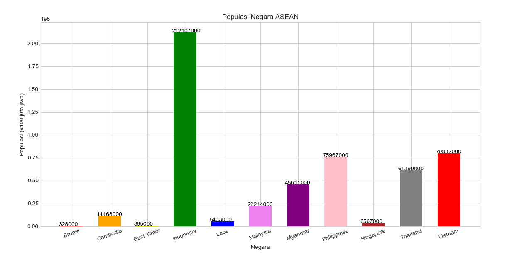
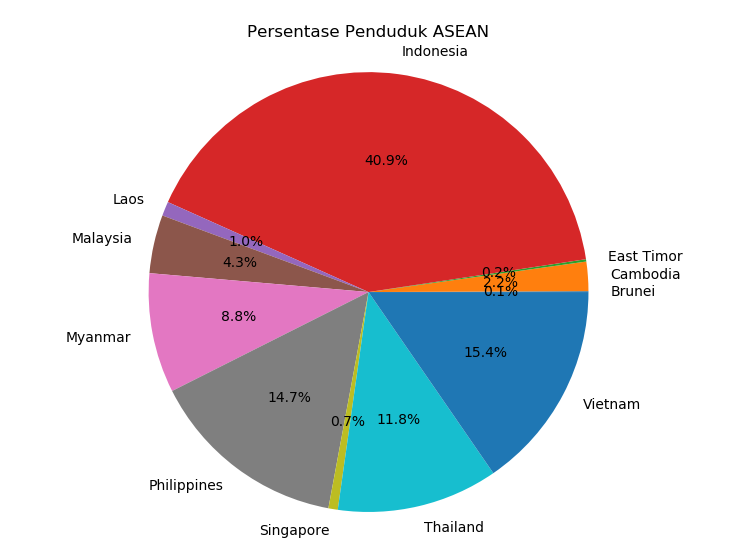
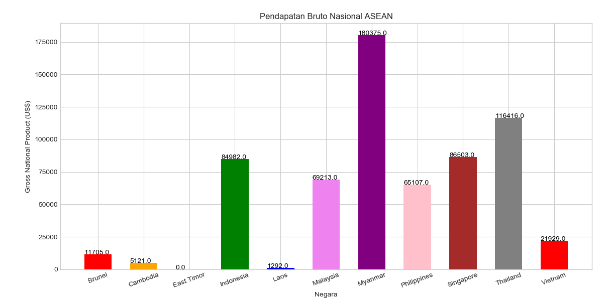
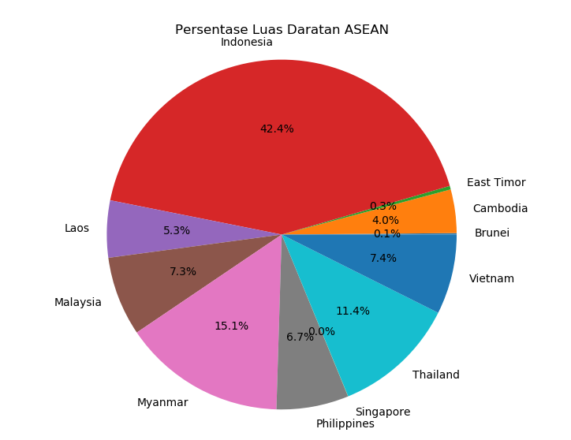

# Data Visualization

Repositori ini merupakan jawaban untuk soal 2 [ujian analytics visualtization JCDS04](https://github.com/LintangWisesa/Ujian_AnalyticsVisualization_JCDS04).

Berisi 4 file python yang setiap filenya menggunakan sqlalchemy untuk menghubungkan python dengan database world yang merupakan database bawaan mysql. Kemudian membuat beberapa bentuk grafik untuk menampilkan data tersebut.

1. [1.py](1.py) Bar Chart Populasi Negara Asean.

2. [2.py](2.py) Pie Chart Persentase Penduduk Asean.

3. [3.py](3.py) Bar Chart Pendapatan Bruto Negara Asean.

4. [4.py](4.py) Pie Chart Persentase Luas Daratan Asean.
